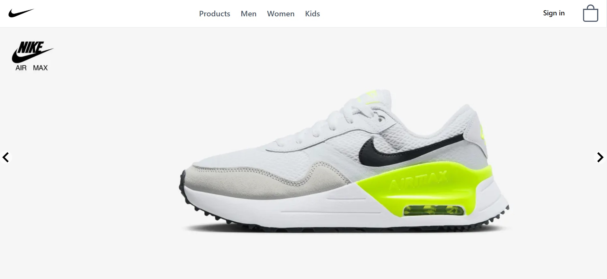
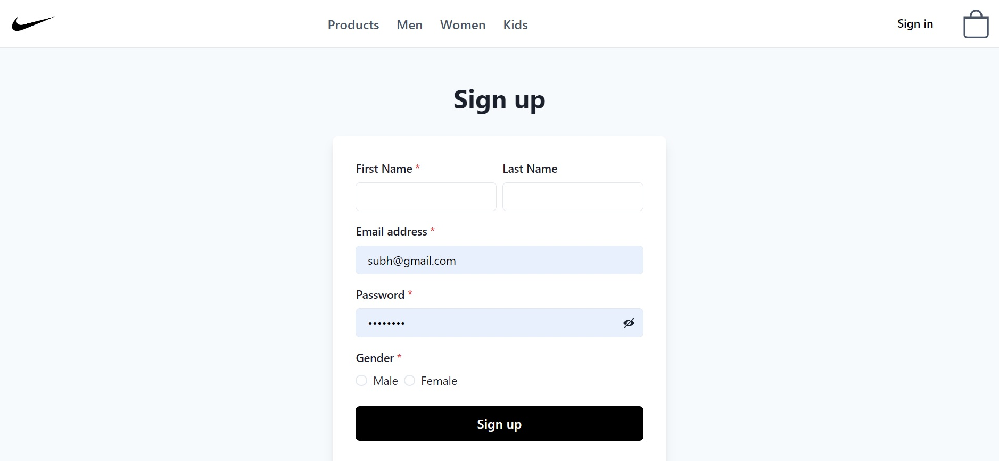
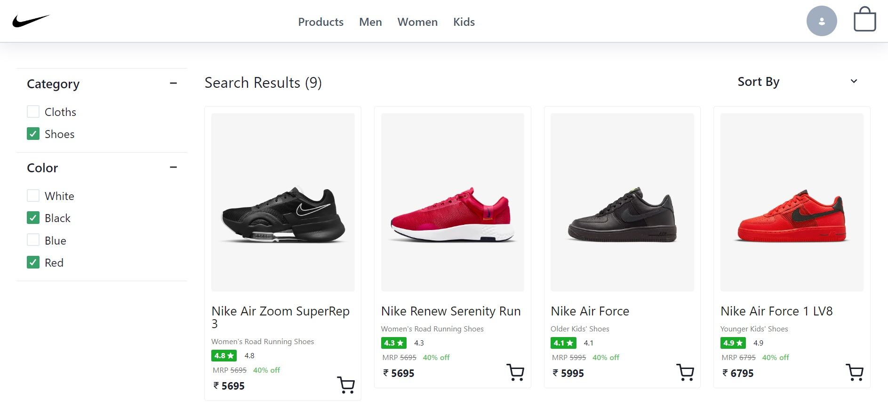
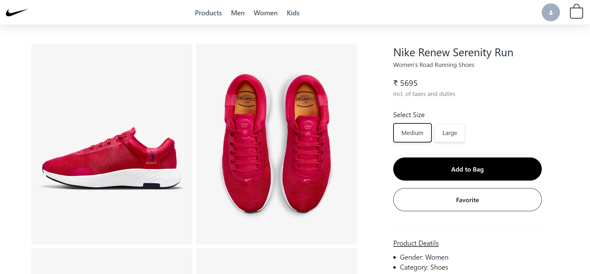
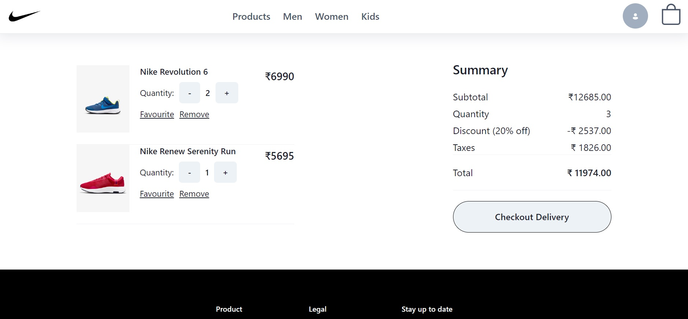
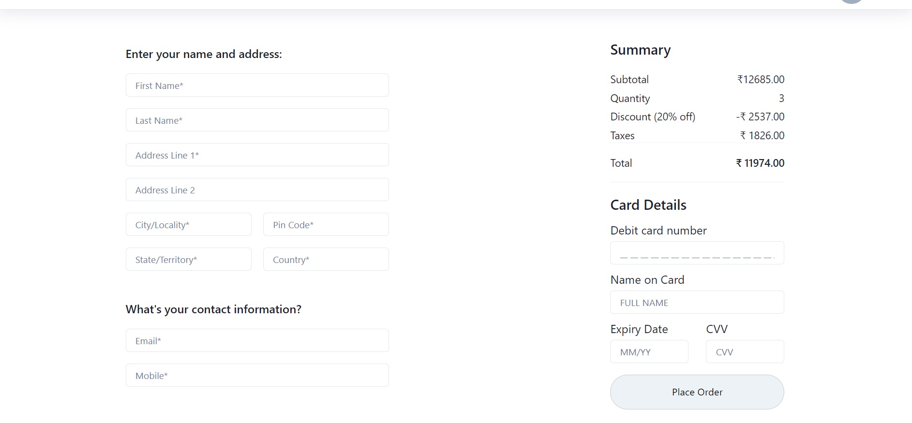
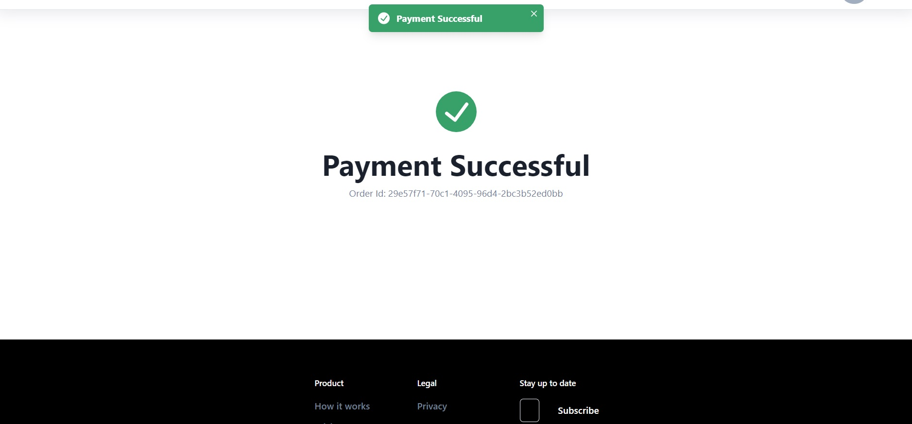
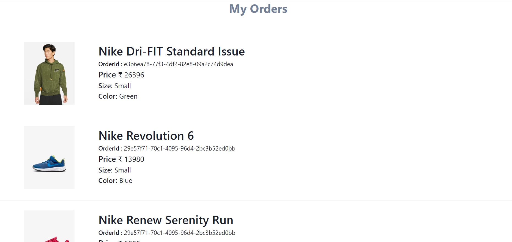

<h1 align="center">Nike</h1>

<h3 align="center">It's a MERN Stack E-commerce web application with all the major functionalities</h3>

 

<h2 align="center">🖥️ Technology Stack Used</h2>
 

#### <b>Frontend :</b> React, Redux, ChakraUI

#### <b>Backend :</b> Node, Express, JWT

#### <b>Database :</b> MongoDB

#### <b>Deployed On :</b> Vercel, Cyclic

 

## <b>Screens</b>

- Homepage Page
- Login / Signup Page
- Product Listing Page
- Men, Women and Kids Section
- Product Description Page
- Cart Page
- Checkout and Payment Page

## 🚀 Features

- Login and Signup User Account
- Handle Multiple Users
- JWT (Json Web Token) Authentication and BcryptJS Password Hashing
- Authorization
- Cart Add and Remove Items
- Cart Update Quantities
- Can see Ordered Items
- Fully Responsive

## Glimpses of Nike-Clone 🙈 :

<table>
  <tr>
    <td></td>
    <td></td>
  </tr>
  
  <tr>
    <td></td>
    <td></td>
  </tr>
  <tr>
    <td></td>
    <td></td>
  </tr>
  <tr>
    <td></td>
       <td></td>
  </tr>
 
 
</table>

## Show your support

Give a ⭐️ if you like this project!
